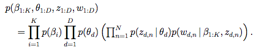
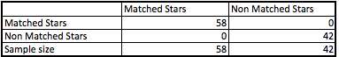

```{r, echo=FALSE, warning=FALSE}
library(MASS)
library(klaR)
library(ggplot2)
```

####Introduction
This is final product of the Coursera Data Science capstone project for the fall 2015 session. The goal of the project is to build a model for prediction star review from its text alone, “Write your tip, we rate for you”.


Consumer’s reviews from web pages and social medias have tremendous impact for the business success also in the performance of the employee work effectiveness. Customers look for a complete and satisfactory experience regarding their performance, quality of service, and many other features. Customers reviews content are more informative than star review although star rating is a valuable way for quick business review.


In this project we implemented NLP (Natural language processing) techniques, Latent Dirichlet Allocation for topic modeling, and external resources to build an algorithm in R environment for star rate prediction. The algorithm will train a 1.6 million reviews and  will be able to make predictions of star review based from its text alone


Main steps of “prediction star review from its text alone” Yelp dataset challenge/capstone project. 


####Methods and Data 
The dataset is part of the Yelp Dataset Challenge and the specific dataset used in this project which corresponds to Round 6 of their challenge. The dataset consists of a set of JSON files that include business information, reviews, tips, user information etc. We have extracted data from yelp academic dataset review file and includes field in review text, star review and review id.

```{r, echo=FALSE }
load("review.RData")
str(review)

```

This plot let us to distinguish the stars density in the general data.

```{r, echo=FALSE}
review$stars<-as.factor(review$stars)
qplot(stars, colour=stars, data=review, geom="density")
```


#####Latent Dirichlet Allocation

Once the text was cleaned up, DocumentTermMatrix  was generated by applying 1 gram, 3 grams and 4-6 grams tokenization on the review dataset, and removing all the sparse terms. We run a Latent Dirichlet Allocation (LDA) using the document-term frequencies matrix of star review language model as input. We obtain most frequent words used for each topic in specific star review. In general, a LDA topic model discerns topics within a relied text review. 

The topics are β1:K, where each $β_{k}$ is a dispersion over the vocabulary
The topic percentages for the d theta document are $θ_{d}$, where $θ_{d, k}$ is the topic proportion for topic k in document d.
The topic assignments for the d theta document are $z_{d}$, where $z_{d, n}$ is the topic assignment for the n theta word in document d.
Result observed words for document d are $w_{d}$, where $w_{w, n}$, n is the n theta word in document d, which is an element from the fixed vocabulary.



#####Rating system
Data were trained in specifc words-star for each star data group: 1 gram, 3 grams and 4-6 grams.

#####Data model sentiment 1 gram

During our exploratory analysis we have distinguished that, there is important difference of containing positive words between 1:2 stars and 4:5 stars. In this project we applied selection of the negative words for star 1 and 2 and positive words for star 4 and 5. Dictionary provided by Hu and Liu (2004) and Liu et al. (2005) were used for the positive and negative words selection. In addition to this, were enhanced number of words by adding negative and positive adverbs, negative adverbs rated manually between 1 and 2 vice versa positive adverbs rated between 4 and 5.

In rating system special attention were paid in the negating words, it was hard to get good results with natural words-star extracted rates. We created a list with negating words and contractions and rated -3  as exclusion from natural rates 1:5. 
```{r, echo=FALSE}
negating<-read.csv("negating.csv")
negating
```

#####Data model sentiment 3 grams
Formation of sentiment 3 grams data model we realized  with collection of vector sentiment 3 grams words  were matched with sentiment 1 gram words for a specific star.  For example: sentiment 3 grams star 4 words relied on matching  words of the sentiment 1 gram star 4. 

#####Data model sentiment 4-6 grams
 Generation of this group data derives direct from LDA topic model selection and contains sentiment words vector from all stars review.


#####Algorithm / Application
In this project we also developed online Shiny application with user-friendly interface. For prediction star review from its text alone we implement 1 gram, 3 grams, 5-6 grams algorithms.

The main tasks in the Shiny app:

1.  Detecting the 1, 3 and 4-6 words of users text input.

2.  Each detected words have rating system based on extracted star.

3.  Calculating mean of the detected words rates, which it corresponds with star rate.

 

#### Results
#####Testing our application. 
Does this application predict accurate?
We took 100-testing sample of review texts from different resources. Each review text has a specific star assigned, copy review text and paste in our application and receiving the predicted star. 
We calculate the matching rate between real stars and test stars.The matched are assigned with 1 and non-matched with 0. 
```{r, echo=FALSE}
application_test<-read.csv("app_testing.csv")
matching_funtion<- function(dataframe){
  df <- dataframe[, sapply(dataframe, is.numeric)]
  vdiff <- function(x){
    y <- outer(x, x, "==")
    min(abs(y[lower.tri(y)]))
  }
  return(apply(df, 1, vdiff))
}
matching<-matching_funtion(application_test)
matching<-as.factor(matching)
application_test<-cbind(application_test, matching )
head(application_test)
```

Predicted accuracy in this sample for matched predicted test star and real star is: 58%.



The app is designed to predict the star review based on the sentiment positive or negative words.  So, to increase accuracy of the star prediction we created a function that allows us to approximate +1, -1 of the real star review.  For example: Real star is 5, predicted star should be 5 or 4 but not 1, 2 and 3...

Predicted accuracy in this sample for approximation test star and real star is: 88%.
Visualization of observations based on classification method Linear Discriminant Analysis  we used function partimat{klaR}.  Important feature of this package is classification borders are displayed and the apparent error rates are given in each title.

```{r, echo=FALSE}
star_approximation<-function( LDL5) {   
  star1<- function(LDL5){for (i in 1:length(LDL5))  
    if( is.na(LDL5[i])) { }  
    else if (LDL5[i] ==2 | LDL5[i] ==1 ) { LDL5 <-1
    }   
    LDL5
  }  
  star_one<-sapply(LDL5, star1)
  star2<- function(LDL5){for (i in 1:length(LDL5))  
    if( is.na(LDL5[i])) { } 
    else if (LDL5[i] ==3 | LDL5[i] ==1 | LDL5[i] ==2) { LDL5 <- 2
    }  
    LDL5
  }  
  star_two<-sapply(LDL5, star2)
  star3<- function(LDL5){for (i in 1:length(LDL5))  
    if( is.na(LDL5[i])) { } 
    else if (LDL5[i] ==4| LDL5[i] ==2 | LDL5[i] ==3) { LDL5 <- 3
    }   
    LDL5
  }
  star_three<-sapply(LDL5, star3)
  star4<- function(LDL5){for (i in 1:length(LDL5))  
    if( is.na(LDL5[i])) { } 
    else if (LDL5[i] ==4 | LDL5[i] ==3 | LDL5[i] ==5) { LDL5<- 4
    }  
    LDL5
  }
  star_four<-sapply(star_two, star4)
  star5<- function(LDL5){for (i in 1:length(LDL5))  
    if( is.na(LDL5[i])) { } 
    else if ( LDL5[i] ==4 |LDL5[i] ==5) { LDL5 <- 5
    }  
    LDL5
  } 
  star_five<-sapply(star_one, star5)
  star_aprox<-c(star_three,  star_four, star_five)
  star_aprox
}


Real.Star_approx<-star_approximation(application_test$ Real.Star)
Test.Star_approx<-star_approximation(application_test$ Test.Star)
aplication_test_approx<-cbind(Real.Star_approx, Test.Star_approx)
aplication_test_approx<-as.data.frame(aplication_test_approx)

matching_funtion<- function(dataframe){
  df <- dataframe[, sapply(dataframe, is.numeric)]
  vdiff <- function(x){
    y <- outer(x, x, "==")
    min(abs(y[lower.tri(y)]))
  }
  return(apply(df, 1, vdiff))
}

matching_approx<-matching_funtion(aplication_test_approx)
matching_approx<-as.factor(matching_approx)
aplication_test_approx<-cbind(aplication_test_approx, matching_approx)
partimat(matching_approx ~ ., data=aplication_test_approx, method="lda")
```


####Conclusion

We think this topic is still very interesting subject and very challenging work. Results does not apply only in business, but also in many other fields such as healthcare, data mining, Neuro-linguistic programming (NLP), neurobiology etc.
Accuracy in our application for star prediction based on its text alone is not as accurate as we want to be. Reasons for this are in the both sides, one side is that customer did not use proper words for star rate another side is application’s algorithm. We have worked very hard and spent enormous time in calculation and came out with some important outcomes, but we are staying keen in improving this application still.


