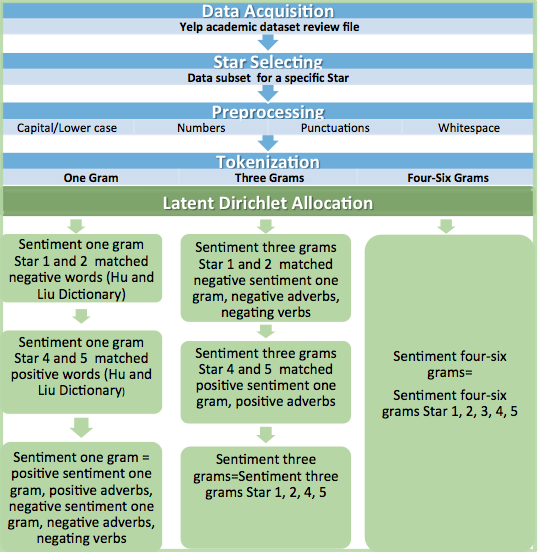
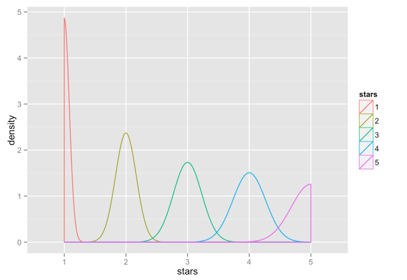
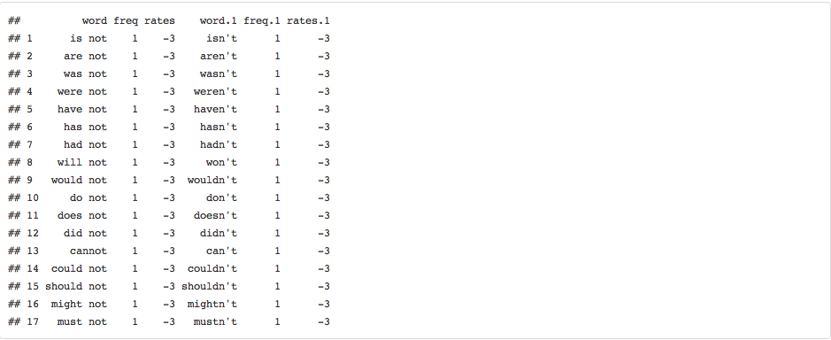
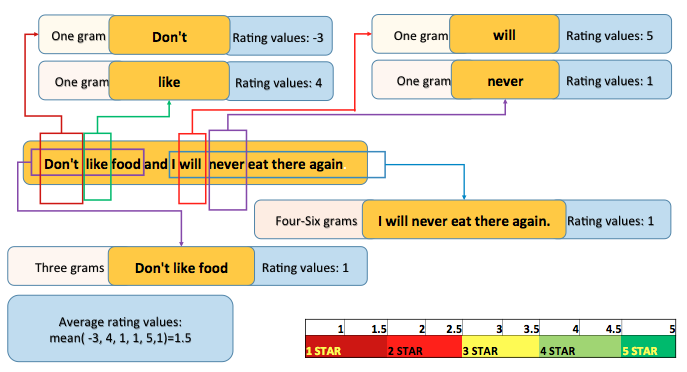

The goal of the project is to build a model for prediction star review from its text alone, “Write your tip, we rate for you”.

In this project we implemented NLP (Natural language processing) techniques, Latent Dirichlet Allocation for topic modeling, and external resources to build an algorithm in R environment for star rate prediction. The algorithm will train a 1.6 million reviews and  will be able to make predictions of star review based from its text alone

Main steps of “prediction star review from its text alone” Yelp dataset challenge/capstone project. 

The data

The dataset is part of the Yelp Dataset Challenge and the specific dataset used in this project which corresponds to Round 6 of their challenge. The dataset consists of a set of JSON files that include business information, reviews, tips, user information etc. We have extracted data from yelp academic dataset review file and includes field in review text, star review and review id.

This plot let us to distinguish the stars density in the general data.

Latent Dirichlet Allocation

Once the text was cleaned up, DocumentTermMatrix  was generated by applying 1 gram, 3 grams and 4-6 grams tokenization on the review dataset, and removing all the sparse terms. We run a Latent Dirichlet Allocation (LDA) using the document-term frequencies matrix of star review language model as input. We obtain most frequent words used for each topic in specific star review. In general, a LDA topic model discerns topics within a relied text review. 

Rating system
Data were trained in specifc words-star for each star data group: 1 gram, 3 grams and 4-6 grams.

Data model sentiment 1 gram

During our exploratory analysis we have distinguished that, there is important difference of containing positive words between 1:2 stars and 4:5 stars. In this project we applied selection of the negative words for star 1 and 2 and positive words for star 4 and 5. Dictionary provided by Hu and Liu (2004) and Liu et al. (2005) were used for the positive and negative words selection. In addition to this, were enhanced number of words by adding negative and positive adverbs, negative adverbs rated manually between 1 and 2 vice versa positive adverbs rated between 4 and 5.

In rating system special attention were paid in the negating words, it was hard to get good results with natural words-star extracted rates. We created a list with negating words and contractions and rated -3  as exclusion from natural rates 1:5. 

Data model sentiment 3 grams

Formation of sentiment 3 grams data model we realized  with collection of vector sentiment 3 grams words  were matched with sentiment 1 gram words for a specific star.  For example: sentiment 3 grams star 4 words relied on matching  words of the sentiment 1 gram star 4. 

Data model sentiment 4-6 grams

 Generation of this group data derives direct from LDA topic model selection and contains sentiment words vector from all stars review.

Algorithm / Application

In this project we also developed online Shiny application with user-friendly interface. For prediction star review from its text alone we implement 1 gram, 3 grams, 5-6 grams algorithms.

The main tasks in the Shiny app:

1.  Detecting the 1, 3 and 4-6 words of users text input.

2.	Each detected words have rating system based on extracted star.

3.  Calculating mean of the detected words rates, which it corresponds with star rate.

 

